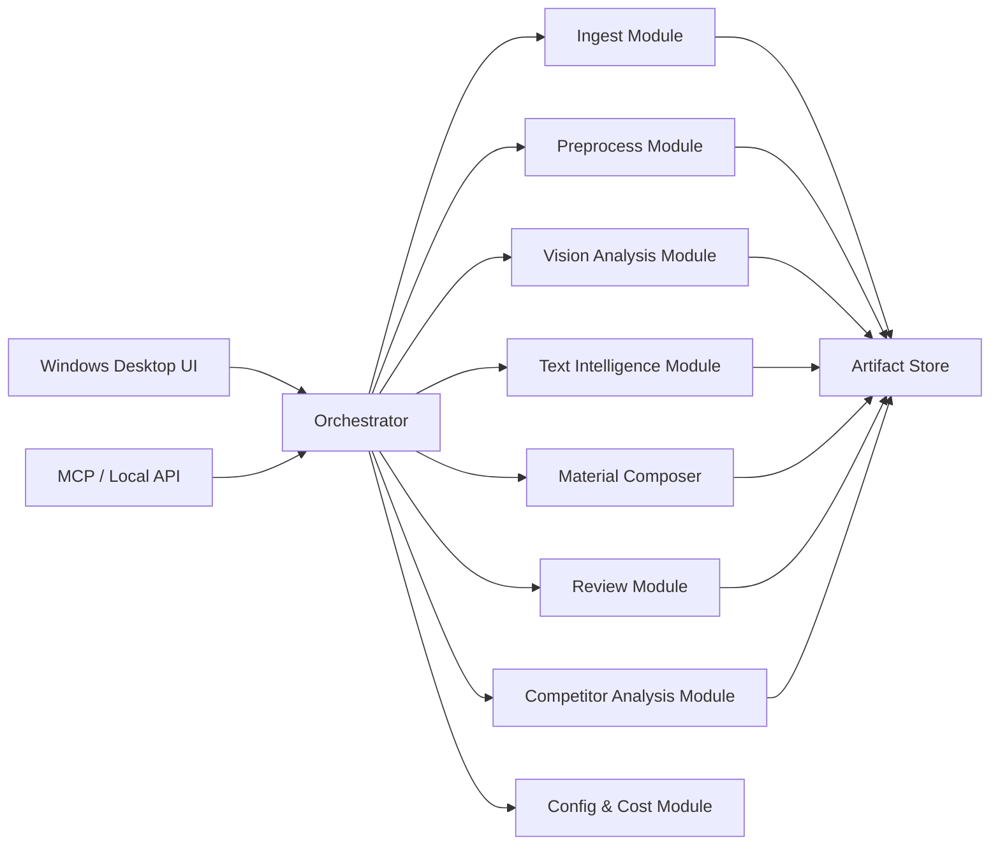

# Short Video Agent Design

## Goal

Build a Windows-first short-video material intelligence agent that stops at:

1. ingesting Douyin links or local videos
2. extracting visual and textual material
3. producing editable content assets
4. accepting generated videos back for review and competitor analysis

Out of scope:

- direct text-to-video generation
- image-to-video generation
- paid video rendering APIs

## Model Strategy

Only two core models are required:

- `Qwen VL`: visual understanding for frames, subtitles, composition, character consistency, scene analysis, and output-video review
- `DeepSeek Flash`: transcript understanding, hook/title extraction, script rewriting, selling-point compression, review writing, and competitor comparison

Supporting local tools:

- downloader: Douyin downloader
- ffmpeg: frame extraction, audio extraction, media normalization
- OCR engine: optional local OCR or VL-assisted OCR fallback
- ASR engine: local or API-based speech-to-text

## Product Scope

The agent produces structured, editable material packs for creators who will generate the final video in external apps.

Primary user outcomes:

- turn a source short video into reusable planning material
- edit script/title/caption assets before generation
- upload a generated result for diagnosis
- compare the result with strong competitors in the same niche

## System Overview



## Modules

### 1. Ingest Module

Responsibilities:

- accept Douyin share links
- resolve short links
- download source video, cover, music, metadata
- accept direct local video upload
- create normalized job workspace

Inputs:

- Douyin URL or local file path

Outputs:

- `source_video.mp4`
- `source_cover.jpg`
- `source_metadata.json`

### 2. Preprocess Module

Responsibilities:

- normalize media format
- extract audio
- sample frames
- detect subtitle regions
- create thumbnails and low-res proxies

Inputs:

- source video

Outputs:

- `audio.wav`
- `frames/frame_*.jpg`
- `keyframes.json`
- `media_probe.json`

### 3. Vision Analysis Module

Model:

- `Qwen VL`

Responsibilities:

- identify speaker identity traits
- identify setting, wardrobe, camera distance, lighting, subtitle style
- summarize shot rhythm and scene continuity
- extract frame-level observations for reuse
- evaluate generated videos later

Inputs:

- sampled frames
- optional OCR text

Outputs:

- `vision_summary.json`
- `frame_analysis.json`
- `visual_style.md`

### 4. Text Intelligence Module

Model:

- `DeepSeek Flash`

Responsibilities:

- structure ASR transcript
- identify hooks, claims, transitions, CTA
- rewrite spoken text into cleaner short-video language
- produce title, subtitle, cover copy, and promo copy candidates
- summarize key messages and audience intent

Inputs:

- ASR transcript
- OCR subtitles
- vision summary

Outputs:

- `transcript_structured.json`
- `content_summary.md`
- `hook_candidates.md`
- `copy_candidates.md`

### 5. Material Composer

Responsibilities:

- assemble all extracted knowledge into a single editable material pack
- keep raw facts and rewritten suggestions separate
- support manual edits and versioning

Inputs:

- metadata
- transcript
- OCR
- vision outputs
- text outputs

Outputs:

- `material_pack.json`
- `editable_script.md`
- `video_prompt_draft.md`

### 6. Review Module

Models:

- `Qwen VL`
- `DeepSeek Flash`

Responsibilities:

- accept a user-generated result video
- diagnose pacing, clarity, subtitle placement, visual quality, hook strength, and information density
- compare output against original plan and expected talking points

Outputs:

- `review_report.md`
- `review_report.json`

### 7. Competitor Analysis Module

Models:

- `Qwen VL`
- `DeepSeek Flash`

Responsibilities:

- compare the result against 1..N competitor videos
- identify differences in hook, pacing, framing, authority cues, density, and subtitle strategy
- generate actionable next-iteration suggestions

Outputs:

- `competitor_report.md`
- `competitor_report.json`

### 8. Config & Cost Module

Responsibilities:

- store model routing and API keys
- define budget caps per batch
- control analysis depth
- track per-job model usage

Outputs:

- `job_cost.json`
- `config_profile.json`

## End-to-End Workflows

### Workflow A: Source Video to Material Pack

1. user imports a Douyin URL or local video
2. ingest module downloads or copies inputs
3. preprocess module extracts frames, audio, and media metadata
4. OCR and ASR run
5. Qwen VL analyzes frames and style
6. DeepSeek Flash interprets transcript and message structure
7. material composer outputs editable assets

### Workflow B: Generated Video Review

1. user uploads generated result video
2. preprocess module samples review frames and transcript
3. Qwen VL checks visual and subtitle issues
4. DeepSeek Flash checks hook, logic, and language quality
5. review module emits issue list and optimization suggestions

### Workflow C: Competitor Analysis

1. user uploads or links competitor videos
2. each competitor is processed into a light material snapshot
3. agent compares user video against competitor set
4. agent outputs delta analysis and tactical recommendations

## Workspace Layout

Suggested per-job folder:

```text
jobs/{job_id}/
  input/
    source_video.mp4
    source_cover.jpg
    source_metadata.json
  derived/
    audio.wav
    frames/
    keyframes.json
    media_probe.json
    ocr.json
    asr.json
  analysis/
    vision_summary.json
    frame_analysis.json
    transcript_structured.json
    content_summary.md
    hook_candidates.md
    copy_candidates.md
  output/
    material_pack.json
    editable_script.md
    video_prompt_draft.md
    review_report.json
    review_report.md
    competitor_report.json
    competitor_report.md
```

## Core Schemas

The following schemas define the contract between modules.

### 1. Job Request

```json
{
  "job_id": "job_20260703_001",
  "mode": "extract",
  "source": {
    "type": "douyin_url",
    "value": "https://v.douyin.com/xxxx/"
  },
  "options": {
    "language": "zh-CN",
    "extract_ocr": true,
    "extract_asr": true,
    "analysis_depth": "standard"
  }
}
```

Schema:

```json
{
  "type": "object",
  "required": ["job_id", "mode", "source"],
  "properties": {
    "job_id": { "type": "string" },
    "mode": { "enum": ["extract", "review", "competitor"] },
    "source": {
      "type": "object",
      "required": ["type", "value"],
      "properties": {
        "type": { "enum": ["douyin_url", "local_video"] },
        "value": { "type": "string" }
      }
    },
    "options": {
      "type": "object",
      "properties": {
        "language": { "type": "string" },
        "extract_ocr": { "type": "boolean" },
        "extract_asr": { "type": "boolean" },
        "analysis_depth": { "enum": ["light", "standard", "deep"] }
      }
    }
  }
}
```

### 2. Media Asset Bundle

```json
{
  "job_id": "job_20260703_001",
  "source_video": "jobs/job_20260703_001/input/source_video.mp4",
  "cover_image": "jobs/job_20260703_001/input/source_cover.jpg",
  "duration_sec": 58.4,
  "resolution": { "width": 1080, "height": 1920 },
  "fps": 25.0,
  "audio_path": "jobs/job_20260703_001/derived/audio.wav",
  "frame_paths": [
    "jobs/job_20260703_001/derived/frames/frame_0001.jpg"
  ],
  "metadata": {
    "platform": "douyin",
    "author_name": "示例作者",
    "title": "示例标题"
  }
}
```

### 3. OCR Segment

```json
{
  "id": "ocr_001",
  "start_sec": 0.4,
  "end_sec": 2.1,
  "text": "为什么少吃还是会胖？",
  "confidence": 0.96,
  "region": { "x": 78, "y": 1440, "w": 920, "h": 140 }
}
```

### 4. ASR Segment

```json
{
  "id": "asr_001",
  "start_sec": 0.0,
  "end_sec": 3.6,
  "speaker": "host",
  "text": "很多时候真正影响胖瘦的，不只是吃多少。",
  "confidence": 0.94
}
```

### 5. Frame Analysis

```json
{
  "frame_id": "frame_0006",
  "timestamp_sec": 6.0,
  "summary": "男性讲师面对镜头口播，中近景，绿色窗帘背景。",
  "subjects": [
    {
      "type": "person",
      "label": "male speaker",
      "attributes": {
        "age_range": "35-45",
        "glasses": true,
        "wardrobe": "浅色衬衫"
      }
    }
  ],
  "style": {
    "shot_size": "medium_close_up",
    "camera_angle": "eye_level",
    "lighting": "soft_front_light",
    "subtitle_present": true
  },
  "issues": []
}
```

### 6. Vision Summary

```json
{
  "video_style": {
    "genre": "health_education_talking_head",
    "tone": "professional_trustworthy",
    "setting": "indoor_study",
    "subtitle_style": "yellow_title_white_body"
  },
  "speaker_profile": {
    "apparent_role": "expert_lecturer",
    "visual_consistency": "stable"
  },
  "visual_findings": [
    "画面稳定，镜头基本静止",
    "字幕不遮挡面部",
    "权威感来自服装、坐姿和背景布置"
  ]
}
```

### 7. Structured Transcript

```json
{
  "summary": "解释少吃不一定瘦，核心变量是压力、胰岛素敏感度和代谢状态。",
  "segments": [
    {
      "id": "seg_01",
      "function": "hook",
      "text": "你会发现你可能吃得更多，但是体重反而下去了。"
    },
    {
      "id": "seg_02",
      "function": "explanation",
      "text": "真正影响胖瘦的，不只是吃多少，而是压力水平和代谢状态。"
    }
  ],
  "keywords": ["压力", "胰岛素敏感度", "代谢平衡"],
  "cta": null
}
```

### 8. Material Pack

This is the main editable output.

```json
{
  "job_id": "job_20260703_001",
  "topic": "为什么少吃还是会胖",
  "audience": "关注健康管理的成年人",
  "speaker_profile": {
    "persona": "专业健康科普讲师",
    "tone": "沉稳、可信、亲和"
  },
  "core_message": [
    "少吃不一定更瘦",
    "压力和代谢状态会影响体重",
    "胰岛素敏感度是关键变量"
  ],
  "editable_script": {
    "hook": "你以为少吃就会瘦，但很多人恰恰相反。",
    "body": [
      "真正影响胖瘦的，不只是热量多少。",
      "压力水平、胰岛素敏感度和代谢平衡，才是更关键的变量。"
    ],
    "ending": "先把身体从高压状态里拉回来，减重才会真正开始。"
  },
  "title_candidates": [
    "为什么少吃还是会胖？",
    "压力不降，少吃也难瘦",
    "你胖，不一定是因为吃得多"
  ],
  "cover_copy_candidates": [
    "少吃还胖，问题不在嘴",
    "压力高，代谢先乱了"
  ],
  "promo_copy": [
    "很多人以为减重靠饿，其实身体状态才是关键。",
    "真正决定你瘦不瘦的，常常不是食量，而是代谢。"
  ],
  "video_prompt_draft": {
    "visual_brief": "竖屏健康科普口播，讲师面对镜头，中近景，字幕简洁专业。",
    "spoken_brief": "中文口播，语速平稳，可信专家表达。"
  },
  "evidence_refs": {
    "vision_summary": "analysis/vision_summary.json",
    "transcript_structured": "analysis/transcript_structured.json"
  }
}
```

### 9. Review Request

```json
{
  "job_id": "job_20260703_001_review_01",
  "mode": "review",
  "source_video": "review/final_video.mp4",
  "expected_material_pack": "output/material_pack.json",
  "review_focus": ["hook", "subtitle_layout", "pacing", "credibility"]
}
```

### 10. Review Report

```json
{
  "summary": "成片人设稳定，但开头钩子弱，字幕密度偏高，前三秒抓力不足。",
  "scores": {
    "hook_strength": 6,
    "visual_clarity": 8,
    "subtitle_readability": 6,
    "information_density": 7,
    "platform_fit": 7
  },
  "issues": [
    {
      "severity": "high",
      "category": "hook",
      "finding": "前3秒没有形成强问题感或反常识冲突。",
      "suggestion": "开头直接抛出“少吃也会胖”的冲突句。"
    },
    {
      "severity": "medium",
      "category": "subtitle_layout",
      "finding": "字幕行数偏多，停留时间略短。",
      "suggestion": "缩短每屏文字长度，保留关键词。"
    }
  ],
  "next_actions": [
    "重写首句钩子",
    "减少字幕单屏字数",
    "增强结尾行动建议"
  ]
}
```

### 11. Competitor Analysis Request

```json
{
  "job_id": "job_20260703_001_comp_01",
  "mode": "competitor",
  "target_video": "review/final_video.mp4",
  "competitor_sources": [
    { "type": "douyin_url", "value": "https://v.douyin.com/example1/" },
    { "type": "local_video", "value": "competitors/comp_02.mp4" }
  ],
  "analysis_focus": ["hook", "authority_cues", "subtitle_style", "pacing"]
}
```

### 12. Competitor Report

```json
{
  "summary": "竞品在前2秒冲突感更强，字幕更短，专家身份提示更早出现。",
  "dimensions": [
    {
      "name": "hook",
      "target": "解释型开头",
      "competitor_pattern": "反常识问题开头",
      "recommendation": "开头先给冲突，再给解释"
    },
    {
      "name": "authority_cues",
      "target": "专家身份出现较晚",
      "competitor_pattern": "首屏即出现身份标签",
      "recommendation": "首屏加入身份信息条"
    }
  ],
  "priority_actions": [
    "强化首屏冲突句",
    "提前展示身份标签",
    "字幕改短句和关键词高亮"
  ]
}
```

### 13. Job Status

```json
{
  "job_id": "job_20260703_001",
  "mode": "extract",
  "state": "completed",
  "current_stage": "material_composer",
  "progress": 100,
  "started_at": "2026-07-03T10:00:00Z",
  "updated_at": "2026-07-03T10:04:31Z",
  "artifacts": {
    "material_pack": "output/material_pack.json",
    "editable_script": "output/editable_script.md"
  },
  "cost": {
    "qwen_vl_calls": 8,
    "deepseek_flash_calls": 5,
    "estimated_cny": 1.82
  },
  "error": null
}
```

## Editing Rules

To keep the product usable, all generated material should follow these rules:

- preserve raw transcript separately from rewritten script
- keep every rewritten field editable by the user
- attach evidence references for non-obvious claims
- distinguish observation from recommendation
- never overwrite user edits without versioning

## API Surface Recommendation

Recommended interfaces:

- desktop UI for creators
- local HTTP API for batch jobs
- MCP tools for nanocodex integration

Suggested API actions:

- `create_extract_job`
- `create_review_job`
- `create_competitor_job`
- `get_job_status`
- `get_material_pack`
- `update_material_pack`
- `export_job_bundle`

## Suggested MVP Cut

The first deliverable should include only:

1. Douyin link import
2. local video import
3. frame extraction
4. ASR + OCR
5. Qwen VL analysis
6. DeepSeek Flash material pack generation
7. editable material pack UI
8. result-video review

Competitor analysis can be phase 2 if schedule is tight.
